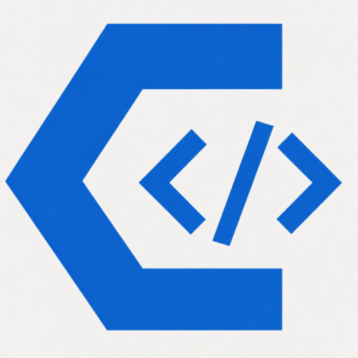

  

<h1 align="center">Chorty — A tua base para aprender a programar.</h1>

  <b>Chorty é um ambiente para aprender a programar, voltado para iniciantes que falam português.</b> 
  Com uma sintaxe simples, diversos exemplos e uma comunidade ativa, o Chorty permite que escrevas lógica no teu idioma e vejas o teu código ganhar vida em 4+ linguagens diferentes — incluindo Python, Java, C e C++.

---

## Porquê Chorty?

- **Lógica em português:** Aprende os conceitos fundamentais da programação sem a barreira do idioma.
- **Entendimento profundo:** Ao veres o teu código a ser traduzido para Python, Java, C ou C++, percebes como as estruturas se traduzem entre linguagens.
- **4+ alvos de saída:** Escreve uma vez e vê o teu código a rodar em Python, C, Java, C++ e mais.
- **Foco no ensino:** Ideal para iniciantes, escolas e qualquer pessoa que queira dar os primeiros passos com confiança.

---

## Como funciona?

1. Escreves o teu algoritmo em Chorty (sintaxe simples e em português).
2. O motor converte o teu código para o alvo escolhido — Python, Java, C, C++ e mais.
3. Vês o resultado a rodar de verdade, na linguagem real.

**O resultado?**
Aprendes lógica, estruturas de dados e algoritmos no teu idioma, e ao mesmo tempo ganhas intimidade com a sintaxe dos vários alvos — sem medo, sem confusão.

---

## Documentação

| Documento | Para quem |
|---|---|
| [Guia para Iniciantes](docs/chorty_iniciantes.md) | Nunca programaste? Começa por aqui — passo a passo, sem jargão. |
| [Documentação do Modo Script](docs/documentacao_script.md) | Referência técnica completa: sintaxe, todos os alvos de saída, compatibilidade entre linguagens. |

---

## Este repositório

Aqui encontras:

- **Documentação oficial** (guias e materiais para iniciantes)
- **Exemplos e exercícios** para praticares
- **O código-fonte do ambiente Chorty**

## Procuras bibliotecas e extensões para importar no teu código? Vê o repositório [comunidade-chorty](https://github.com/adilson889/comunidade-chorty).

---

## Junta-te à comunidade

O Chorty é feito por e para falantes de português.
Dá uma ⭐ no repositório, explora os exemplos e começa a tua jornada.

  <b>Aprende lógica em português. Conquista qualquer linguagem. Chorty é a tua base.</b>

